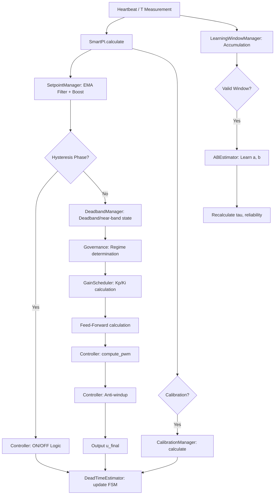

# Smart-PI: Technical and Scientific Documentation

## 1. Introduction

**Smart-PI** is a self-adaptive thermal regulation algorithm designed for the *Versatile Thermostat* integration. Its goal is to replace classic TPI (Time Proportional Integral) controllers that require complex manual coefficient tuning.

Smart-PI's approach relies on online identification of a simplified first-order thermal model, allowing the controller gains (Kp, Ki) to adapt to the actual physical characteristics of the room (inertia, insulation, heating power).

This document details the mathematical foundations, the software architecture, and the safety mechanisms of the algorithm.

---

## 2. Mathematical Model

### 2.1 First-Order Thermal Model

The thermal system (the heated room) is modeled by a first-order ordinary differential equation (ODE):


$$ \frac{dT_{int}}{dt} = a \cdot u(t) - b \cdot (T_{int}(t) - T_{ext}(t)) $$


Where:
- $T_{int}$: Indoor temperature (°C)
- $T_{ext}$: Outdoor temperature (°C)
- $u(t) \in [0, 1]$: Heating command (Duty Cycle)
- $a$: Heating efficiency (°C/min at 100% power)
- $b$: Thermal loss coefficient ($min^{-1}$)

The system **time constant** is given by:


$$ \tau = \frac{1}{b} \quad (\text{minutes}) $$


The **equilibrium temperature** for a constant command $u$ is:


$$ T_{eq} = T_{ext} + \frac{a}{b} \cdot u $$


### 2.2 Adaptive PI Control Law

The controller implements a standard PI (Proportional Integral) control law, but with gains $K_p$ and $K_i$ dynamically calculated based on $\tau$.

The raw controller output is:


$$ u_{PI}(t) = K_p \cdot e_p(t) + \int K_i \cdot e(t) \, dt $$


Where:
- $e(t) = T_{setpoint} - T_{int}$: Tracking error
- $e_p(t)$: Weighted error for proportional action (see *Setpoint Weighting*)

The final command includes a **Feed-Forward** (anticipation) term:


$$ u(t) = u_{PI}(t) + u_{FF}(t) $$


---

## 3. Online Identification (Learning)

The estimation of parameters $a$ and $b$ is performed by the `ABEstimator` class. It uses a robust hybrid approach to reject measurement noise and disturbances (solar gains, window openings).

### 3.0 Bootstrap Learning Priority (Hysteresis Phase)

When the system starts for the first time (phase `HYSTERESIS`), learning follows a **mandatory 3-step sequence**:

1.  **Step 1 — Dead Time first**: Before any `a`/`b` measurements are collected, the system waits until dead times are measured. Collection of `a` (heating) is blocked until `deadtime_heat_reliable = True`. Collection of `b` (cooling) is blocked until `deadtime_cool_reliable = True`. During this step, `bootstrap_state` shows: `step1 - deadtime: heat:Xs [A:x/7] cool:null`.

2.  **Step 2 — Initial collection**: Once both dead times are acquired, the system collects the first `emeas` (minimum 7 points for `a`, 11 points for `b`). `bootstrap_state`: `step2 - collecting emeas: A:x/7 B:x/11`.

3.  **Step 3 — Full learning**: Builds the complete history (31 measurements). `bootstrap_state`: `step3 - learning thermal model: A:x/31 B:x/31`.

This sequencing ensures that dead times — essential for filtering learning windows — are available before the first `a`/`b` measurements are accepted, improving their quality.

In ON phase, `a` learning applies a two-level sequential gate:
- Soft gate: `a` is blocked only while `learn_ok_count_b < 5`.
- Dynamic collection threshold for `a`:
  - `AB_MIN_SAMPLES_A = 7` while `b` is not converged.
  - `AB_MIN_SAMPLES_A_CONVERGED = 11` once `b` is converged.

`b` convergence is evaluated by `b_converged_for_a()` with these 4 cumulative criteria:
1. `learn_ok_count_b >= AB_B_CONVERGENCE_MIN_SAMPLES` (11).
2. `len(_b_hat_hist) >= AB_B_CONVERGENCE_MIN_BHIST` (5).
3. `MAD(b_hat)/Med(b_hat) <= AB_B_CONVERGENCE_MAD_RATIO` (0.30).
4. `range(last_5_b_hat)/Med(b_hat) <= AB_B_CONVERGENCE_RANGE_RATIO` (0.10).

### 3.1 Continuous Learning Strategy (Window-Based)

Smart-PI uses **continuous and asynchronous** learning.

#### Sliding Window
The algorithm accumulates data (T_int, T_ext, Power) continuously. A learning attempt is triggered as soon as a valid "window" is detected:
1.  **Minimum duration**: The episode must last long enough (e.g., > 10 min heating, > 15 min cooling).
2.  **Amplitude**: The temperature variation must be significant (e.g., > 0.2°C).
3.  **Power consistency**: Power must have remained stable (either > 20% to learn `a`, or < 5% to learn `b`).

Once these conditions are met, the algorithm "closes" the window and launches identification.

#### Robustness (Theil-Sen & Median+MAD)
On the identified window:
1.  **Slope calculation**: Using the **Theil-Sen** estimator to extract the derivative $\frac{dT_{int}}{dt}$ robustly against noise.
2.  **Estimation of $a$ and $b$**:
    - If $u \approx 0$ (Cooling): $b$ is estimated.
    - If $u > 0$ (Heating): $a$ is estimated (using the current $b$).
3.  **Statistical filtering**: New estimates are added to a history. The final value used for control is the **Median** of this history, filtered by **MAD** (Median Absolute Deviation) to reject outliers.


### 3.2 Dead Time Estimation

Managed by the `DeadTimeEstimator` class.

The algorithm uses a **Finite State Machine (FSM)** to detect clear power transitions and measure the thermal reaction delay.

#### 1. State Machine (FSM)
The estimator monitors power $u$ transitions:
- **OFF -> ON transition**: Triggers the `WAITING_HEAT_RESPONSE` state. The algorithm records the timestamp and initial temperature.
- **ON -> OFF transition**: Triggers the `WAITING_COOL_RESPONSE` state.
- **Validity conditions**: The transition must be clear-cut (e.g., from <1% to >80% power) and the system must have been stable long enough before the step.

#### 2. Takeoff Detection
In the `WAITING_HEAT_RESPONSE` state, the algorithm monitors $T_{int}$ evolution:
- If $T_{int} - T_{initial} \ge 0.05°C$ (detection threshold), the dead time is validated.
- $L = t_{current} - t_{transition}$.

#### 3. Cooling Response Detection
Similarly, in the `WAITING_COOL_RESPONSE` state, the algorithm waits for a significant temperature drop from the peak to validate the cooling dead time.

This FSM approach is much more robust to sensor noise and micro-oscillations than purely slope-based methods.

---

## 4. Smart-PI Control Algorithm

### 4.1 Gain Calculation Heuristic (Auto-Tuning)

PI gain calculation depends on model reliability and dead time $L$ estimation.

#### Case 1: Reliable Dead Time ($L$) (IMC Method)
If the dead time is known and $> 1$ min, the algorithm favors an **IMC (Internal Model Control)** approach suited for systems with delay:

$$ K_{p, IMC} = \frac{1}{2 \cdot a \cdot L} $$

For safety, the **minimum** between this IMC gain and the heuristic gain below is retained.

#### Case 2: Standard Heuristic (Based on $\tau$)
If the dead time is not yet known or reliable, or to bound the IMC gain:

$$ K_{p, heu} = 0.35 + 0.9 \cdot \sqrt{\frac{\tau}{200}} $$

#### $K_i$ Calculation
The integral is tuned to compensate for the system's dominant dynamics $\tau$:

$$ K_i = \frac{K_p}{\max(\tau, 10)} $$

Safety bounds ($K_{p,min}, K_{p,max}$) are always applied.

#### Case 3: Forced Calibration Phase
If the model drifts or if reaction delays (dead times) become unreliable, the **AutoCalibTrigger** supervisor initiates a forced calibration. The system temporarily switches to **Hysteresis** mode and follows a 3-step cycle:
1.  **COOL_DOWN**: Cut power until temperature drops to $sp - 0.3°C$.
2.  **HEAT_UP**: Force 100% power until $sp + 0.5°C$ (Heating Dead Time measurement).
3.  **COOL_DOWN_FINAL**: Cut power until $sp - 0.3°C$ (Cooling Dead Time measurement).
Once validated, the algorithm returns to **Stable Mode**.

Once this cycle is complete, the algorithm returns to **STABLE** mode.

### 4.2 Advanced Control Mechanisms

#### Anti-Windup (Conditional Integration)
To prevent integral runaway when the actuator saturates (0% or 100%):
- The integral is frozen if ($u=100\%$ and $e>0$) OR ($u=0\%$ and $e<0$).

#### Setpoint Weighting (2-DOF)
The proportional error is weighted to reduce overshoot during setpoint changes:


$$ e_p = \beta \cdot T_{setpoint} - T_{int} $$


With $\beta = 0$ or a low value, this transforms the P action into feedback on measurement alone, softening the step response. In Smart-PI, implicit weighting is used via *Setpoint Boost* and filtering.

#### Near-Band Scheduling (Asymmetric & Auto-adaptive)
Within a narrow band around the setpoint, gains $K_p$ and $K_i$ are reduced to stabilize the valve.
- **Asymmetry (Heating)**: The band is wider *below* the setpoint (for a "soft landing"), but remains tight above to react quickly to overshoot.
- **Dead Time Auto-Tuning**: The band width adapts dynamically to the dead time $L$.
  - The algorithm calculates the horizon $H = L + \frac{\text{cycle}}{2}$.
  - The band $NB$ is then defined by $NB = \text{Deadband} + \text{Margin} + (\text{Slope} \cdot H)$.
  - The slower the system ($L$ large), the wider the band to anticipate the slowdown.
- Reduction factors: $Kp_{near} = 0.8 \cdot Kp$, $Ki_{near} = 0.6 \cdot Ki$.

#### Thermal Guard (Protection Hysteresis)
During a **setpoint decrease** (or switch to Eco mode), the integrator is placed under strict monitoring:
- As long as the indoor temperature has not dropped below the new setpoint, the integral is **frozen** (prevented from increasing) or forced to decrease.
- This prevents the integral term from inflating unnecessarily during the natural cooling phase.

#### Sign-Flip Leak (Gentle Discharge)
When the error changes sign (transition from under-heating to over-heating or vice versa), the integral is multiplied by a leak factor ($< 1$) for a few cycles. This helps desaturate the integral faster than the natural I term action, limiting overshoot.

#### Feed-Forward (Anticipation)
A predictive command is added to compensate for estimated static losses:


$$ u_{FF} = \frac{b}{a} \cdot (T_{setpoint} - T_{ext}) $$


This term relieves the integrator, which only needs to correct model errors and unmodeled disturbances.

#### Feed-Forward Soft-Gating & Smoothing
To prevent erratic behavior when the model is still learning or when conditions are unstable, the Feed-Forward term is gated and smoothed:
- **Soft-Gate**: The FF term is only applied if the learned parameters ($a, b$) are sufficiently reliable and consistent. A dynamic scale factor (`ff_scale`) fades the FF term in/out based on model quality (0.0 to 1.0).
- **Inertia Smoothing**: The FF output is smoothed using a thermal inertia buffer ($H\_inertia$) to avoid sudden jumps in power command when outdoor temperature fluctuates rapidly. This buffer adapts to the system's time constant.

#### Instant Shut-off (Hysteresis & Protection)
Although Smart-PI generally operates in PWM cycles, some protections act instantly:
- In **Hysteresis** mode, if the temperature exceeds the upper threshold, shut-off is immediate (the current cycle is interrupted).
- In case of **open window** or switch to **OFF**, shut-off is also immediate.

#### Resume Management
After an interruption (e.g., open window closed), the algorithm observes a silence period ("grace period") before resuming `a` and `b` learning, to allow the transient dynamics to stabilize.


---

## 5. Software Architecture

### 5.1 Overview

The code adopts a **modular composition architecture** (Facade pattern). The orchestrating class `SmartPI` aggregates specialized components, each responsible for one aspect of the regulation.

#### Orchestrator Files

| File | Class | Role |
|------|-------|------|
| `prop_algo_smartpi.py` | `SmartPI` | Facade / algorithmic orchestrator |
| `prop_handler_smartpi.py` | `SmartPIHandler` | Home Assistant bridge (persistence, services, attributes) |

#### `smartpi/` Package

| Module | Class / Function | Responsibility |
|--------|------------------|----------------|
| `const.py` | — | Constants, enums (`SmartPIPhase`, `GovernanceRegime`, etc.), governance matrix |
| `controller.py` | `SmartPIController` | PI calculation, integral management, anti-windup, hysteresis |
| `gains.py` | `GainScheduler` | Adaptive Kp/Ki calculation (heuristic + IMC), governance freeze application |
| `learning.py` | `ABEstimator`, `DeadTimeEstimator` | Robust identification of parameters $a$, $b$ (Median+MAD) and dead time $L$ (FSM) |
| `learning_window.py` | `LearningWindowManager` | Multi-cycle learning data accumulation, gating |
| `deadband.py` | `DeadbandManager` | Deadband/near-band state machine, auto near-band sizing |
| `calibration.py` | `CalibrationManager` | Forced calibration state machine (COOL_DOWN → HEAT_UP → COOL_DOWN_FINAL) |
| `governance.py` | `SmartPIGovernance` | Regime determination and freeze decisions (governance matrix) |
| `setpoint.py` | `SmartPISetpointManager` | Asymmetric EMA setpoint filter, boost detection |
| `diagnostics.py` | `build_diagnostics()` | UI attribute dictionary construction |
| `timestamp_utils.py` | — | Monotonic ↔ wall-clock conversion |

### 5.2 Facade Pattern

The `SmartPI` class instantiates all components at construction:

```python
self.gov = SmartPIGovernance(name)
self.sp_mgr = SmartPISetpointManager(name, enabled=use_setpoint_filter)
self.ctl = SmartPIController(name)
self.est = ABEstimator()
self.learn_win = LearningWindowManager(name)
self.deadband_mgr = DeadbandManager(name, near_band_deg)
self.calibration_mgr = CalibrationManager(name)
self.gain_scheduler = GainScheduler(name)
self.dt_est = DeadTimeEstimator()
```

It redirects 40+ properties to internal components to maintain a unified API (e.g., `SmartPI.Kp` → `GainScheduler.kp`).

### 5.3 Persistence

Each component exposes `save_state() → dict` and `load_state(dict)`. The `SmartPI` class aggregates them into a nested dictionary:

```python
{
    "est_state": {...},      # ABEstimator
    "dt_est_state": {...},   # DeadTimeEstimator
    "gov_state": {...},      # Governance
    "ctl_state": {...},      # Controller
    "sp_mgr_state": {...},   # SetpointManager
    "lw_state": {...},       # LearningWindowManager
    "db_state": {...},       # DeadbandManager
    "cal_state": {...},      # CalibrationManager
    "gs_state": {...},       # GainScheduler
    "ac_state": {...},       # AutoCalibTrigger
}
```

### 5.5 Auto-Calibration Supervision (AutoCalibTrigger)

The `AutoCalibTrigger` class acts as an external watchdog for the algorithm. It ensures that the model remains high-quality over time without requiring user intervention.

#### 1. The Snapshot Mechanism
Smart-PI stores a "best-known" version of its parameters ($a, b, dt\_heat, dt\_cool$).
- **Initial Snapshot**: Taken as soon as all estimators are marked as reliable.
- **Rolling Snapshot**: Every 5 days ($T_{snapshot}$) if the system is stable.
- **Fallback (Winter)**: In heating-only systems, if no cooling dead time is found after 7 days, a snapshot is taken using only heating data.

#### 2. Stagnation Criteria
Every hour, the supervisor monitors:
- **Estimation Progress**: Difference between current successful observations and snapshot counts.
- **Statistical Quality**: $MAD_{a}/Med_{a}$ and $MAD_{b}/Med_{b}$ thresholds.
- **Reliability Flags**: Loss of reliability on dead time estimators.

#### 3. Execution Cycle (CalibrationManager)
The actual cycle is an asynchronous FSM:
- `IDLE` $\rightarrow$ `COOL_DOWN` $\rightarrow$ `HEAT_UP` $\rightarrow$ `COOL_DOWN_FINAL` $\rightarrow$ `IDLE`.

#### 4. Verification and Retries
After a cycle, the supervisor validates the results:
- **Success Criteria**: At least 5 new observations for $a$ and $b$, plus reliable dead times.
- **Retry Logic**: If improvement is insufficient, a retry is scheduled with a delay ($T_{retry} = 24h$).
- **Model Degraded**: After 3 failed retries, the `model_degraded` flag is set to alert the user.

A migration layer (`_migrate_old_state_format`) ensures compatibility with the old flat-key format.

### 5.4 Flow Diagram




---

## 6. Scientific References

1. **Sundaresan K.R. and Krishnaswamy P.R.**, "Estimation of Time Delay Time Constant Parameters in Time, Frequency, and Laplace Domains", *Canadian Journal of Chemical Engineering*, 1978. (Method used for the dead time estimator)
2. **Astrom K.J. and Hagglund T.**, "Advanced PID Control", ISA, 2006. (Anti-windup concepts, setpoint weighting, and tuning methods).
3. **Theil-Sen Estimator**: Robust linear regression method insensitive to outliers (up to 29%), used conceptually for linear model validation.

## 7. Parameters and Advanced Configuration

Key parameters are defined in `smartpi/const.py`:

#### Gains and Regulation

| Constant | Value | Description |
|----------|-------|-------------|
| `KP_SAFE`, `KI_SAFE` | 0.55, 0.010 | Fallback gains when model is unreliable |
| `KP_MIN`, `KP_MAX` | 0.10, 5.0 | Safety bounds for Kp |
| `KI_MIN`, `KI_MAX` | 0.001, 0.050 | Safety bounds for Ki |
| `MAX_STEP_PER_MINUTE` | 0.25 | Command rate limit (/min) |
| `SETPOINT_BOOST_RATE` | 0.50 | Rate limit in Boost mode (/min) |
| `AW_TRACK_TAU_S` | 120.0 | Anti-windup tracking time constant (seconds) |
| $T_{check}$ | `_HOURLY_CHECK_INTERVAL_S` | 3600 | Supervision check interval (s) |
| $T_{snapshot}$ | `AUTOCALIB_SNAPSHOT_PERIOD_H` | 120 | Rolling snapshot period (5 days) |
| $T_{cooldown}$ | `AUTOCALIB_COOLDOWN_H` | 24 | Minimum rest between two calibrations |
| $T_{retry}$ | `AUTOCALIB_RETRY_DELAY_H` | 24 | Delay before retrying after failure |
| $Max_{retries}$ | `AUTOCALIB_MAX_RETRIES` | 3 | Maximum number of failed attempts |
| $Thr_{mad\_a}$ | `AUTOCALIB_A_MAD_THRESHOLD` | 0.40 | Stagnation threshold for $a$ |
| $Thr_{mad\_b}$ | `AUTOCALIB_B_MAD_THRESHOLD` | 0.50 | Stagnation threshold for $b$ |
| `SMARTPI_RECALC_INTERVAL_SEC` | 60 | Forced PI recalculation interval (Heartbeat) |

#### Learning and Identification

| Constant | Value | Description |
|----------|-------|-------------|
| `AB_HISTORY_SIZE` | 31 | Median+MAD history size |
| `AB_MIN_SAMPLES_B` | 11 | Minimum samples to start `b` estimation |
| `AB_MIN_SAMPLES_A` | 7 | Minimum samples to start `a` estimation while `b` is not converged |
| `AB_MIN_SAMPLES_A_CONVERGED` | 11 | Minimum samples for `a` estimation once `b` is converged |
| `AB_A_SOFT_GATE_MIN_B` | 5 | Minimum validated `b` samples to allow `a` learning |
| `AB_B_CONVERGENCE_MIN_SAMPLES` | 11 | Minimum validated `b` samples to consider `b` converged |
| `AB_B_CONVERGENCE_MIN_BHIST` | 5 | Minimum `_b_hat_hist` size for `b` convergence |
| `AB_B_CONVERGENCE_MAD_RATIO` | 0.30 | Max relative dispersion `MAD/Med` threshold for `b` |
| `AB_B_CONVERGENCE_RANGE_RATIO` | 0.10 | Max `range(last_5)/Med` threshold for `b` |
| `AB_MAD_SIGMA_MULT` | 3.0 | Outlier rejection threshold (sigma count) |
| `LEARN_QUALITY_THRESHOLD` | 0.25 | Minimum quality (QI) to accept a learning episode |
| `EPISODE_MIN_DURATION_ON_S` | 600 | Minimum ON episode duration (10 min) |
| `EPISODE_MIN_DURATION_OFF_S` | 900 | Minimum OFF episode duration (15 min) |
| `LEARNING_PAUSE_RESUME_MIN` | 20 | Learning pause after resume (minutes) |

#### Hysteresis and Bands

| Constant | Value | Description |
|----------|-------|-------------|
| `HYST_UPPER_C`, `HYST_LOWER_C` | 0.5, 0.3 | ON/OFF thresholds in Hysteresis phase (°C) |
| `DEFAULT_DEADBAND_C` | 0.05 | Default deadband (°C) |
| `DEADBAND_BELOW_C`, `DEADBAND_ABOVE_C` | 0.06, 0.04 | Asymmetric deadband in heating mode (°C) |
| `DEFAULT_NEAR_BAND_DEG` | 0.40 | Default manual near-band (°C) |
| `DEFAULT_KP_NEAR_FACTOR` | 0.80 | Kp reduction factor in near-band |
| `DEFAULT_KI_NEAR_FACTOR` | 0.60 | Ki reduction factor in near-band |

#### Calibration

| Constant | Value | Description |
|----------|-------|-------------|
| `FORCE_CALIBRATION_INTERVAL_HOURS` | 72 | Periodic calibration interval (hours) |
| `CALIBRATION_RETRY_MAX` | 1 | Maximum automatic retry count |
| `CALIBRATION_TIMEOUT_MIN` | 600 | Per-phase calibration timeout (minutes) |

#### Feed-Forward Gate
| Constant | Value | Description |
|----------|-------|-------------|
| `ENABLE_FF_SOFTGATE` | False | Enable dynamic scaling of FF based on model quality |
| `FF_SOFTGATE_D_MIN_C` | 0.10 | Min anticipation distance (°C) for FF activation |
| `FF_SOFTGATE_D_MAX_C` | 2.00 | Max anticipation distance (°C) for full FF |
| `FF_SOFTGATE_MIN_LEARN_OK_A` | 10 | Min valid learning samples for `a` |


## 8. Safety-First Governance

To ensure the stability of the thermal model against real-world uncertainties, Smart-PI integrates a supervision layer called **Safety-First Governance**. Its role is to detect physical regimes that are inappropriate for learning and to freeze parameter adaptation.

### 8.1 Governance Regimes (`GovernanceRegime`)

At each cycle, the algorithm identifies the regime in which the system operates:

- **WARMUP**: Startup phase (a few cycles) where transient dynamics are too strong.
- **EXCITED_STABLE**: Ideal regime for learning (outside the deadband, with sufficient excitation).
- **NEAR_BAND**: Immediate proximity to the setpoint; gains are reduced, learning is frozen.
- **DEAD_BAND**: System at equilibrium; no useful information for learning.
- **HOLD**: Setpoint is stable and error is zero; parameters are maintained.
- **PERTURBED**: Strong external disturbance detected (e.g., window opening, massive solar gain).
- **DEGRADED**: Invalid sensor or missing data.
- **SATURATED**: Actuator saturated at 0% or 100% for too long.

### 8.2 Governance Decisions (`GovernanceDecision`)

Based on the detected regime, the supervisor makes a decision for thermal model and PI gains adaptation:

- **ADAPT_ON**: Allows updating parameters $a$ and $b$.
- **FREEZE**: Temporarily freezes learning but preserves current state.
- **HARD_FREEZE**: Freezes learning and resets certain safeties (e.g., anti-windup).
- **SOFT_FREEZE_DOWN**: Only allows decrease of gains or integral for safety reasons.

### 8.3 Diagnostic Codes (`FreezeReason`)

When frozen, the `freeze_reason_thermal` and `freeze_reason_gains` attributes help understand the cause:
- `NONE`: No freeze, adaptation allowed.
- `REGIME_TRANSITION`: Regime transition in progress (non-homogeneous cycle).
- `CYCLE_INVALID`: Invalid cycle.
- `EVENT_POLLUTED`: External event polluted the data.
- `SENSOR_INVALID`: Unreliable temperature or setpoint.
- `DEADTIME_UNRELIABLE`: Unreliable dead time.
- `BOOT_GUARD`: Protection during the first minutes of startup.
- `DEAD_BAND`: System in the deadband.
- `NEAR_BAND`: System in the near-band.
- `WARMUP`: Startup phase.
- `HOLD`: Integrator on hold.
- `PERTURBED`: External disturbance detected.
- `SATURATION`: Actuator saturated.
- `SYSTEM_INEFFICIENT`: System is not responding as expected by the model.

---

This document serves as a reference for the maintenance and evolution of the Smart-PI algorithm.
