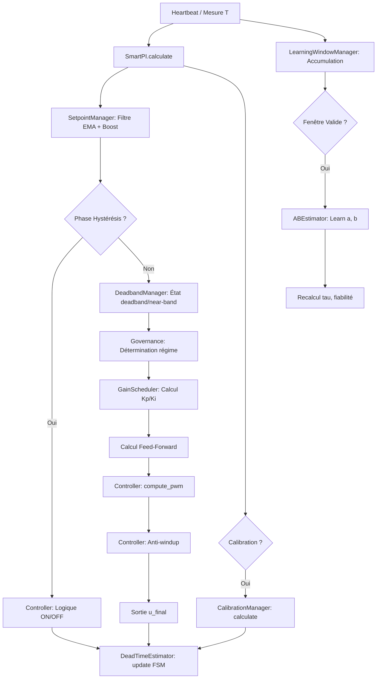

# Smart-PI: Documentation Technique et Scientifique

## 1. Introduction

**Smart-PI** est un algorithme de régulation thermique auto-adaptatif conçu pour l'intégration *Versatile Thermostat*. Il a pour objectif de remplacer les régulateurs TPI (Time Proportional Integral) classiques qui nécessitent un réglage manuel complexe des coefficients.

L'approche de Smart-PI repose sur l'identification en ligne d'un modèle thermique simplifié du premier ordre, permettant d'adapter les gains du régulateur (Kp, Ki) aux caractéristiques physiques réelles de la pièce (inertie, isolation, puissance de chauffage).

Ce document détaille les fondements mathématiques, l'architecture logicielle et les mécanismes de sécurité de l'algorithme.

---

## 2. Modèle Mathématique

### 2.1 Modèle Thermique du Premier Ordre

Le système thermique (la pièce chauffée) est modélisé par une équation différentielle ordinaire (EDO) du premier ordre :


$$ \frac{dT_{int}}{dt} = a \cdot u(t) - b \cdot (T_{int}(t) - T_{ext}(t)) $$


Où :
- $T_{int}$ : Température intérieure (°C)
- $T_{ext}$ : Température extérieure (°C)
- $u(t) \in [0, 1]$ : Commande de chauffage (Duty Cycle)
- $a$ : Efficacité du chauffage (°C/min à 100% de puissance)
- $b$ : Coefficient de pertes thermiques ($min^{-1}$)

La **constante de temps** du système est donnée par :


$$ \tau = \frac{1}{b} \quad (\text{minutes}) $$


La **température d'équilibre** pour une commande constante $u$ est :


$$ T_{eq} = T_{ext} + \frac{a}{b} \cdot u $$


### 2.2 Loi de Commande PI Adaptative

Le régulateur implémente une loi de commande PI (Proportionnelle Intégrale) standard, mais dont les gains $K_p$ et $K_i$ sont calculés dynamiquement en fonction de $\tau$.

La sortie brute du régulateur est :


$$ u_{PI}(t) = K_p \cdot e_p(t) + \int K_i \cdot e(t) \, dt $$


Avec :
- $e(t) = T_{consigne} - T_{int}$ : Erreur de suivi
- $e_p(t)$ : Erreur pondérée pour l'action proportionnelle (voir *Setpoint Weighting*)

La commande finale inclut un terme de **Feed-Forward** (anticipation) :


$$ u(t) = u_{PI}(t) + u_{FF}(t) $$


---

## 3. Identification en Ligne (Learning)

L'estimation des paramètres $a$ et $b$ est réalisée par la classe `ABEstimator`. Elle utilise une approche hybride robuste pour rejeter le bruit de mesure et les perturbations (apports solaires, ouverture de fenêtres).

### 3.1 Stratégie d'Apprentissage Continue (Window-Based)

Contrairement à l'ancienne approche cycle par cycle, Smart-PI utilise un apprentissage **continu et asynchrone**.

#### Fenêtre Glissante (Sliding Window)
L'algorithme accumule les données (T_int, T_ext, Puissance) au fil de l'eau. Une tentative d'apprentissage est déclenchée dès qu'une "fenêtre" valide est détectée :
1.  **Durée minimale** : L'épisode doit durer suffisamment longtemps (ex: > 10 min en chauffe, > 15 min en refroidissement).
2.  **Amplitude** : La variation de température doit être significative (ex: > 0.2°C).
3.  **Cohérence de la puissance** : La puissance doit être restée stable (soit > 20% pour apprendre `a`, soit < 5% pour apprendre `b`).

Une fois ces conditions réunies, l'algorithme "ferme" la fenêtre et lance l'identification.

#### Robustesse (Theil-Sen & Median+MAD)
Sur la fenêtre identifiée :
1.  **Calcul de la Pente** : Utilisation de l'estimateur de **Theil-Sen** pour extraire la dérivée $\frac{dT_{int}}{dt}$ de manière robuste au bruit.
2.  **Estimation $a$ et $b$** :
    - Si $u \approx 0$ (Refroidissement) : On estime $b$.
    - Si $u > 0$ (Chauffe) : On estime $a$ (en utilisant le $b$ courant).
3.  **Filtrage Statistique** : Les nouvelles estimations sont ajoutées à un historique. La valeur finale utilisée pour le contrôle est la **Médiane** de cet historique, filtrée par **MAD** (Median Absolute Deviation) pour rejeter les valeurs aberrantes.


### 3.2 Estimation du Temps Mort (Dead Time)
Géré par la classe `DeadTimeEstimator`.

L'algorithme utilise une **Machine à États Finis (FSM)** pour détecter les transitions franches de puissance et mesurer le délai de réaction thermique.

#### 1. Machine à États (FSM)
L'estimateur surveille les transitions de puissance $u$ :
- **Transition OFF -> ON** : Déclenche l'état `WAITING_HEAT_RESPONSE`. L'algorithme enregistre le timestamp et la température initiale.
- **Transition ON -> OFF** : Déclenche l'état `WAITING_COOL_RESPONSE`.
- **Conditions de validité** : La transition doit être franche (ex: passage de <1% à >80% de puissance) et le système doit être resté stable suffisamment longtemps avant le saut.

#### 2. Détection de Décollage (Takeoff)
Dans l'état `WAITING_HEAT_RESPONSE`, l'algorithme surveille l'évolution de $T_{int}$ :
- Si $T_{int} - T_{initiale} \ge 0.05°C$ (seuil de détection), le temps mort est validé.
- $L = t_{actuel} - t_{transition}$.

#### 3. Détection de Descente (Cooling Response)
De même, dans l'état `WAITING_COOL_RESPONSE`, l'algorithme attend une baisse significative de température par rapport au pic atteint pour valider le temps mort de refroidissement.

Cette approche FSM est beaucoup plus robuste aux bruits de capteurs et aux micro-oscillations que les méthodes purement basées sur la pente.

---

## 4. Algorithme de Contrôle Smart-PI

### 4.1 Heuristique de Calcul des Gains (Auto-Tuning)

Le calcul des gains PI dépend de la fiabilité du modèle et de l'estimation du temps mort $L$.

#### Cas 1 : Temps Mort ($L$) Fiable (Méthode IMC)
Si le temps mort est connu et $> 1$ min, l'algorithme privilégie une approche **IMC (Internal Model Control)** adaptée aux systèmes avec retard :

$$ K_{p, IMC} = \frac{1}{2 \cdot a \cdot L} $$

Par sécurité, on retient le **minimum** entre ce gain IMC et le gain heuristique ci-dessous.

#### Cas 2 : Heuristique Standard (Basée sur $\tau$)
Si le temps mort n'est pas encore connu ou fiable, ou pour borner le gain IMC :

$$ K_{p, heu} = 0.35 + 0.9 \cdot \sqrt{\frac{\tau}{200}} $$

#### Calcul de $K_i$
L'intégrale est réglée pour compenser la dynamique dominante du système $\tau$ :

$$ K_i = \frac{K_p}{\max(\tau, 10)} $$

Des bornes de sécurité ($K_{p,min}, K_{p,max}$) sont toujours appliquées.

#### Cas 3 : Phase de Calibration Forcée
Si les données de modèle sont absentes ou jugées obsolètes (72h), Smart-PI force un cycle d'apprentissage en mode hystérésis. La FSM de calibration suit les étapes suivantes :
1.  **COOL_DOWN** : Puissance à 0% jusqu'à descendre sous `Consigne - 0.3°C`.
2.  **HEAT_UP** : Puissance à 100% jusqu'à dépasser `Consigne + 0.5°C`. Cette phase permet de capturer $L_{heat}$.
3.  **COOL_DOWN_FINAL** : Puissance à 0% jusqu'à redescendre sous le seuil bas. Cette phase permet de capturer $L_{cool}$.

Une fois ce cycle terminé, l'algorithme repasse en mode **STABLE**.

### 4.2 Mécanismes Avancés de Contrôle

#### Anti-Windup (Conditional Integration)
Pour éviter l'emballement de l'intégrale lorsque l'actionneur sature (0% ou 100%) :
- L'intégrale est gelée si ($u=100\%$ et $e>0$) OU ($u=0\%$ et $e<0$).

#### Setpoint Weighting (2-DOF)
L'erreur proportionnelle est pondérée pour réduire l'overshoot lors des changements de consigne :


$$ e_p = \beta \cdot T_{consigne} - T_{int} $$


Avec $\beta = 0$ ou une valeur faible, cela transforme l'action P en une rétroaction sur la mesure seule, adoucissant la réponse aux échelons. Dans Smart-PI, une pondération implicite est utilisée via le *Setpoint Boost* et le filtrage.

#### Near-Band Scheduling (Asymétrique & Auto-adaptatif)
Dans une bande étroite autour de la consigne, les gains $K_p$ et $K_i$ sont réduits pour stabiliser la vanne.
- **Asymétrie (Chauffage)** : La bande est plus large *en dessous* de la consigne (pour "atterrir" en douceur), mais reste serrée au-dessus pour réagir vite au dépassement.
- **Auto-Tuning sur Temps Mort** : La largeur de la bande s'adapte dynamiquement au temps mort $L$.
  - L'algorithme calcule l'horizon $H = L + \frac{\text{cycle}}{2}$. 
  - La bande $NB$ est alors définie par $NB = \text{Deadband} + \text{Marge} + (\text{Pente} \cdot H)$.
  - Plus le système est lent ($L$ grand), plus la bande est large pour anticiper le ralentissement.
- Facteurs de réduction : $Kp_{near} = 0.8 \cdot Kp$, $Ki_{near} = 0.6 \cdot Ki$.

#### Thermal Guard (Hystérésis de Protection)
Lors d'une **baisse de consigne** (ou passage en mode Eco), l'intégrateur est mis sous surveillance stricte :
- Tant que la température intérieure n'est pas redescendue en dessous de la nouvelle consigne, l'intégrale est **gelée** (interdiction d'augmenter) ou forcée à décroître.
- Cela empêche le terme intégral de gonfler inutilement pendant la phase de refroidissement naturel.

#### Sign-Flip Leak (Décharge douce)
Lorsque l'erreur change de signe (passage de sous-chauffe à sur-chauffe ou inversement), l'intégrale est multipliée par un facteur de fuite ($< 1$) pendant quelques cycles. Cela aide à désaturer l'intégrale plus vite que l'action naturelle du terme I, limitant le dépassement.

#### Feed-Forward (Anticipation)
Une commande prédictive est ajoutée pour compenser les pertes statiques estimées :


$$ u_{FF} = \frac{b}{a} \cdot (T_{consigne} - T_{ext}) $$


Ce terme soulage l'intégrateur qui n'a plus qu'à corriger les erreurs de modèle et les perturbations non modélisées.

#### Instant Shut-off (Hystérésis & Protection)
Bien que Smart-PI fonctionne généralement en cycles PWM, certaines protections agissent instantanément :
- En mode **Hystérésis**, si la température dépasse le seuil haut, la coupure est immédiate (le cycle en cours est interrompu).
- En cas de **fenêtre ouverte** ou de passage à **OFF**, la coupure est également immédiate.

#### Gestion de la Reprise (Resume)
Après une interruption (ex: fenêtre ouverte refermée), l'algorithme observe une période de silence ("grace period") avant de reprendre l'apprentissage `a` et `b`, afin de laisser la dynamique transitoire se stabiliser.


---

## 5. Architecture Logicielle

### 5.1 Vue d'ensemble

Le code adopte une architecture **modulaire par composition** (pattern Façade). La classe orchestratrice `SmartPI` agrège des composants spécialisés, chacun responsable d'un aspect de la régulation.

#### Fichiers orchestrateurs

| Fichier | Classe | Rôle |
|---------|--------|------|
| `prop_algo_smartpi.py` | `SmartPI` | Façade / orchestrateur algorithmique |
| `prop_handler_smartpi.py` | `SmartPIHandler` | Pont avec Home Assistant (persistance, services, attributs) |

#### Package `smartpi/`

| Module | Classe / Fonction | Responsabilité |
|--------|-------------------|----------------|
| `const.py` | — | Constantes, enums (`SmartPIPhase`, `GovernanceRegime`, etc.), matrice de gouvernance |
| `controller.py` | `SmartPIController` | Calcul PI, gestion de l'intégrale, anti-windup, hystérésis |
| `gains.py` | `GainScheduler` | Calcul adaptatif de Kp/Ki (heuristique + IMC), application du gel de gouvernance |
| `learning.py` | `ABEstimator`, `DeadTimeEstimator` | Identification robuste des paramètres $a$, $b$ (Médiane+MAD) et du temps mort $L$ (FSM) |
| `learning_window.py` | `LearningWindowManager` | Accumulation multi-cycle des données d'apprentissage, gating |
| `deadband.py` | `DeadbandManager` | Machine à états deadband/near-band, dimensionnement auto de la near-band |
| `calibration.py` | `CalibrationManager` | Machine à états de la calibration forcée (COOL_DOWN → HEAT_UP → COOL_DOWN_FINAL) |
| `governance.py` | `SmartPIGovernance` | Détermination du régime et décisions de gel (matrice de gouvernance) |
| `setpoint.py` | `SmartPISetpointManager` | Filtre EMA asymétrique de consigne, détection de boost |
| `diagnostics.py` | `build_diagnostics()` | Construction du dictionnaire d'attributs pour l'UI |
| `timestamp_utils.py` | — | Conversion monotonic ↔ wall-clock |

### 5.2 Pattern Façade

La classe `SmartPI` instancie tous les composants à la construction :

```python
self.gov = SmartPIGovernance(name)
self.sp_mgr = SmartPISetpointManager(name, enabled=use_setpoint_filter)
self.ctl = SmartPIController(name)
self.est = ABEstimator()
self.learn_win = LearningWindowManager(name)
self.deadband_mgr = DeadbandManager(name, near_band_deg)
self.calibration_mgr = CalibrationManager(name)
self.gain_scheduler = GainScheduler(name)
self.dt_est = DeadTimeEstimator()
```

Elle redirige 40+ propriétés vers les composants internes pour maintenir une API unifiée (ex: `SmartPI.Kp` → `GainScheduler.kp`).

### 5.3 Persistance

Chaque composant expose `save_state() → dict` et `load_state(dict)`. La classe `SmartPI` les agrège dans un dictionnaire imbriqué :

```python
{
    "est_state": {...},      # ABEstimator
    "dt_est_state": {...},   # DeadTimeEstimator
    "gov_state": {...},      # Governance
    "ctl_state": {...},      # Controller
    "sp_mgr_state": {...},   # SetpointManager
    "lw_state": {...},       # LearningWindowManager
    "db_state": {...},       # DeadbandManager
    "cal_state": {...},      # CalibrationManager
    "gs_state": {...},       # GainScheduler
}
```

Une couche de migration (`_migrate_old_state_format`) assure la compatibilité avec l'ancien format à clés plates.

### 5.4 Diagramme de Flux




---

## 6. Références Scientifiques

1. **Sundaresan k.R. and Krishnaswamy P.R.**, "Estimation of Time Delay Time Constant Parameters in Time, Frequency, and Laplace Domains", *Canadian Journal of Chemical Engineering*, 1978. (Méthode utilisée pour l'estimateur de temps mort)
2. **Astrom K.J. and Hagglund T.**, "Advanced PID Control", ISA, 2006. (Concepts d'anti-windup, setpoint weighting et méthodes de réglage).
3. **Theil-Sen Estimator**: Méthode de régression linéaire robuste insensible aux outliers (jusqu'à 29%), utilisée conceptuellement pour la validation du modèle linéaire.

## 7. Paramètres et Configuration Avancée

Les paramètres clés sont définis dans `smartpi/const.py` :

#### Gains et régulation

| Constante | Valeur | Description |
|-----------|--------|-------------|
| `KP_SAFE`, `KI_SAFE` | 0.55, 0.010 | Gains de repli si le modèle n'est pas fiable |
| `KP_MIN`, `KP_MAX` | 0.10, 5.0 | Bornes de sécurité pour Kp |
| `KI_MIN`, `KI_MAX` | 0.001, 0.050 | Bornes de sécurité pour Ki |
| `MAX_STEP_PER_MINUTE` | 0.25 | Limitation de vitesse de la commande (/min) |
| `SETPOINT_BOOST_RATE` | 0.50 | Limitation de vitesse en mode Boost (/min) |
| `AW_TRACK_TAU_S` | 120.0 | Constante de temps de l'anti-windup tracking (secondes) |
| `SMARTPI_RECALC_INTERVAL_SEC` | 60 | Intervalle de recalcul forcé du PI (Heartbeat) |

#### Apprentissage et identification

| Constante | Valeur | Description |
|-----------|--------|-------------|
| `AB_HISTORY_SIZE` | 31 | Taille de l'historique Médiane+MAD |
| `AB_MIN_SAMPLES` | 11 | Minimum d'échantillons pour démarrer l'estimation |
| `AB_MAD_SIGMA_MULT` | 3.0 | Seuil de rejet des outliers (nombre de sigma) |
| `LEARN_QUALITY_THRESHOLD` | 0.25 | Qualité minimale (QI) pour accepter un apprentissage |
| `EPISODE_MIN_DURATION_ON_S` | 600 | Durée min d'un épisode ON (10 min) |
| `EPISODE_MIN_DURATION_OFF_S` | 900 | Durée min d'un épisode OFF (15 min) |
| `LEARNING_PAUSE_RESUME_MIN` | 20 | Pause d'apprentissage après reprise (minutes) |

#### Hystérésis et bandes

| Constante | Valeur | Description |
|-----------|--------|-------------|
| `HYST_UPPER_C`, `HYST_LOWER_C` | 0.5, 0.3 | Seuils ON/OFF en phase Hystérésis (°C) |
| `DEFAULT_DEADBAND_C` | 0.05 | Bande morte par défaut (°C) |
| `DEADBAND_BELOW_C`, `DEADBAND_ABOVE_C` | 0.06, 0.04 | Bande morte asymétrique en chauffage (°C) |
| `DEFAULT_NEAR_BAND_DEG` | 0.40 | Near-band manuelle par défaut (°C) |
| `DEFAULT_KP_NEAR_FACTOR` | 0.80 | Facteur de réduction Kp en near-band |
| `DEFAULT_KI_NEAR_FACTOR` | 0.60 | Facteur de réduction Ki en near-band |

#### Calibration

| Constante | Valeur | Description |
|-----------|--------|-------------|
| `FORCE_CALIBRATION_INTERVAL_HOURS` | 72 | Intervalle de calibration périodique (heures) |
| `CALIBRATION_RETRY_MAX` | 1 | Nombre max de tentatives automatiques |
| `CALIBRATION_TIMEOUT_MIN` | 600 | Timeout par phase de calibration (minutes) |


## 8. Gouvernance Safety-First

Pour garantir la stabilité du modèle thermique face aux aléas du monde réel, Smart-PI intègre une couche de supervision appelée **Safety-First Governance**. Son rôle est de détecter les régimes physiques inappropriés pour l'apprentissage et de geler l'adaptation des paramètres.

### 8.1 Régimes de Gouvernance (`GovernanceRegime`)

À chaque cycle, l'algorithme identifie le régime dans lequel se trouve le système :

- **WARMUP** : Phase de démarrage (quelques cycles) où les dynamiques transitoires sont trop fortes.
- **EXCITED_STABLE** : Régime idéal pour l'apprentissage (en dehors de la bande morte, avec une excitation suffisante).
- **NEAR_BAND** : Proximité immédiate de la consigne ; les gains sont réduits, l'apprentissage est gelé.
- **DEAD_BAND** : Système à l'équilibre ; aucune information utile pour l'apprentissage.
- **HOLD** : La consigne est stable et l'erreur est nulle ; maintien des paramètres.
- **PERTURBED** : Détection d'une perturbation externe forte (ex: ouverture fenêtre, apport solaire massif).
- **DEGRADED** : Capteur invalide ou données manquantes.
- **SATURATED** : L'actionneur est saturé à 0% ou 100% depuis trop longtemps.

### 8.2 Décisions de Gouvernance (`GovernanceDecision`)

Selon le régime détecté, le superviseur prend une décision pour l'adaptation du modèle thermique et des gains PI :

- **ADAPT_ON** : Autorise la mise à jour des paramètres $a$ and $b$.
- **FREEZE** : Gèle temporairement l'apprentissage mais conserve l'état courant.
- **HARD_FREEZE** : Gèle l'apprentissage et réinitialise certaines sécurités (ex: anti-windup).
- **SOFT_FREEZE_DOWN** : Autorise uniquement la diminution des gains ou de l'intégrale pour des raisons de sécurité.

### 8.3 Codes de Diagnostic (`FreezeReason`)

En cas de gel, les attributs `freeze_reason_thermal` et `freeze_reason_gains` permettent de comprendre la cause :
- `NONE` : Pas de gel, adaptation autorisée.
- `REGIME_TRANSITION` : Transition de régime en cours (cycle non homogène).
- `CYCLE_INVALID` : Cycle invalide.
- `EVENT_POLLUTED` : Événement externe a pollué les données.
- `SENSOR_INVALID` : Température ou consigne non fiable.
- `DEADTIME_UNRELIABLE` : Temps mort non fiable.
- `BOOT_GUARD` : Protection durant les premières minutes du démarrage.
- `DEAD_BAND` : Système dans la bande morte.
- `NEAR_BAND` : Système dans la near-band.
- `WARMUP` : Phase de démarrage.
- `HOLD` : Intégrateur en maintien.
- `PERTURBED` : Perturbation externe détectée.
- `SATURATION` : Actionneur saturé.
- `SYSTEM_INEFFICIENT` : Le système ne réagit pas comme attendu par le modèle.

---

Ce document sert de référence pour la maintenance et l'évolution de l'algorithme Smart-PI.
