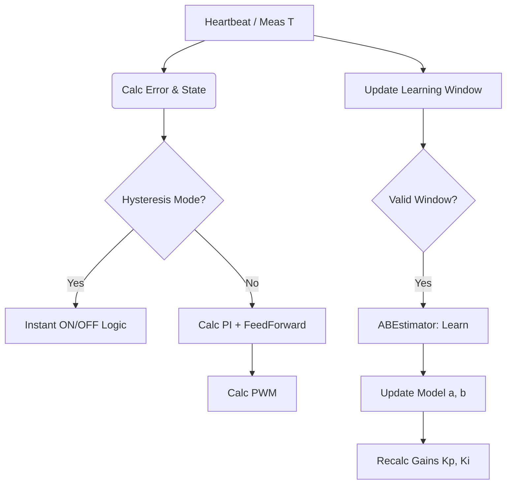

# Smart-PI: Technical and Scientific Documentation

## 1. Introduction

**Smart-PI** is a self-adaptive thermal regulation algorithm designed for *Versatile Thermostat* integration. Its objective is to replace traditional TPI (Time Proportional Integral) regulators that require complex manual tuning of coefficients.

The Smart-PI approach is based on online identification of a simplified first-order thermal model, enabling the regulator gains (Kp, Ki) to adapt to the actual physical characteristics of the room (inertia, insulation, heating power).

This document details the mathematical foundations, software architecture, and safety mechanisms of the algorithm.

---

## 2. Mathematical Model

### 2.1 First-Order Thermal Model

The thermal system (heated room) is modeled by a first-order ordinary differential equation (ODE):

$$ \frac{dT_{int}}{dt} = a \cdot u(t) - b \cdot (T_{int}(t) - T_{ext}(t)) $$

Where:
- $T_{int}$ : Interior temperature (°C)
- $T_{ext}$ : Exterior temperature (°C)
- $u(t) \in [0, 1]$ : Heating command (Duty Cycle)
- $a$ : Heating efficiency (°C/min at 100% power)
- $b$ : Thermal loss coefficient ($min^{-1}$)

The **time constant** of the system is given by:

$$ \tau = \frac{1}{b} \quad (\text{minutes}) $$

The **equilibrium temperature** for a constant command $u$ is:

$$ T_{eq} = T_{ext} + \frac{a}{b} \cdot u $$

### 2.2 Adaptive PI Control Law

The regulator implements a standard PI (Proportional Integral) control law, but whose gains $K_p$ and $K_i$ are dynamically calculated based on $\tau$.

The raw regulator output is:

$$ u_{PI}(t) = K_p \cdot e_p(t) + \int K_i \cdot e(t) \, dt $$

With:
- $e(t) = T_{setpoint} - T_{int}$ : Tracking error
- $e_p(t)$ : Weighted error for proportional action (see *Setpoint Weighting*)

The final command includes a **Feed-Forward** (anticipation) term:

$$ u(t) = u_{PI}(t) + u_{FF}(t) $$

---

## 3. Online Identification (Learning)

The estimation of parameters $a$ and $b$ is performed by the `ABEstimator` class. It uses a robust hybrid approach to reject measurement noise and disturbances (solar gains, window opening).

### 3.1 Continuous Learning Strategy (Window-Based)

Unlike the legacy cycle-by-cycle approach, Smart-PI uses **continuous and asynchronous** learning.

#### Sliding Window
The algorithm accumulates data (T_int, T_ext, Power) continuously. A learning attempt is triggered as soon as a valid "window" is detected:
1.  **Minimum Duration**: The episode must last long enough (e.g., > 10 min for heating, > 15 min for cooling).
2.  **Amplitude**: Temperature variation must be significant (e.g., > 0.2°C).
3.  **Power Consistency**: Power must remain stable (either > 20% to learn `a`, or < 5% to learn `b`).

Once these conditions are met, the algorithm "closes" the window and launches identification.

#### Robustness (Theil-Sen & Median+MAD)
On the identified window:
1.  **Slope Calculation**: Uses the **Theil-Sen** estimator to extract the derivative $\frac{dT_{int}}{dt}$ robustly against noise.
2.  **Estimation of $a$ and $b$**:
    - If $u \approx 0$ (Cooling): Estimate $b$.
    - If $u > 0$ (Heating): Estimate $a$ (using current $b$).
3.  **Statistical Filtering**: New estimates are added to a history buffer. The final value used for control is the **Median** of this history, filtered by **MAD** (Median Absolute Deviation) to reject outliers.

### 3.2 Dead Time Estimation
Managed by the `DeadTimeEstimator` class.

The algorithm uses a **Finite State Machine (FSM)** to detect sharp power transitions and measure the thermal reaction delay.

#### 1. State Machine (FSM)
The estimator monitors power transitions $u$:
- **OFF -> ON Transition**: Triggers the `WAITING_HEAT_RESPONSE` state. The algorithm records the timestamp and initial temperature.
- **ON -> OFF Transition**: Triggers the `WAITING_COOL_RESPONSE` state.
- **Validity Conditions**: The transition must be sharp (e.g., from <1% to >80% power) and the system must have remained stable for long enough before the jump.

#### 2. Takeoff Detection
In the `WAITING_HEAT_RESPONSE` state, the algorithm monitors the evolution of $T_{int}$:
- If $T_{int} - T_{initial} \ge \text{detection\_threshold}$ (typically 0.05°C), the dead time is validated.
- $L = t_{current} - t_{transition}$.

#### 3. Cooling Response Detection
Similarly, in the `WAITING_COOL_RESPONSE` state, the algorithm waits for a significant temperature drop relative to the peak reached to validate the cooling dead time.

This FSM approach is much more robust to sensor noise and micro-oscillations than purely slope-based methods.

---

## 4. Smart-PI Control Algorithm

### 4.1 Gain Calculation Heuristic (Auto-Tuning)

PI gain calculation depends on model reliability and dead time $L$ estimation.

#### Case 1: Reliable Dead Time ($L$) (IMC Method)
If dead time is known and $> 1$ min, the algorithm favors an **IMC (Internal Model Control)** approach adapted for systems with delay:

$$ K_{p, IMC} = \frac{1}{2 \cdot a \cdot L} $$

For safety, the **minimum** between this IMC gain and the heuristic gain below is retained.

#### Case 2: Standard Heuristic (Based on $\tau$)
If dead time is not yet known or unreliable, or to bound the IMC gain:

$$ K_{p, heu} = 0.35 + 0.9 \cdot \sqrt{\frac{\tau}{200}} $$

#### Calculation of $K_i$
The integral is tuned to compensate for the system's dominant dynamic $\tau$:

$$ K_i = \frac{K_p}{\max(\tau, 10)} $$

Safety limits ($K_{p,min}, K_{p,max}$) are always applied.

#### Case 3: Forced Calibration Phase
If model data is missing or deemed obsolete (48h), Smart-PI forces a learning cycle in hysteresis mode. The calibration FSM follows these steps:
1.  **COOL_DOWN**: Power at 0% until dropping below `Setpoint - 0.3°C`.
2.  **HEAT_UP**: Power at 100% until exceeding `Setpoint + 0.5°C`. This phase captures $L_{heat}$.
3.  **COOL_DOWN_FINAL**: Power at 0% until dropping back below the lower threshold. This phase captures $L_{cool}$.

Once this cycle is complete, the algorithm returns to **STABLE** mode.

### 4.2 Advanced Control Mechanisms

#### Anti-Windup (Conditional Integration)
To prevent integral windup when the actuator saturates (0% or 100%):
- The integral is frozen if ($u=100\%$ and $e>0$) OR ($u=0\%$ and $e<0$).

#### Setpoint Weighting (2-DOF)
The proportional error is weighted to reduce overshoot during setpoint changes:

$$ e_p = \beta \cdot T_{setpoint} - T_{int} $$

With $\beta = 0$ or a low value, this transforms the P action into measurement-only feedback, smoothing the step response. In Smart-PI, implicit weighting is used via *Setpoint Boost* and filtering.

#### Near-Band Scheduling (Asymmetric & Auto-Adaptive)
Within a narrow band around the setpoint, gains $K_p$ and $K_i$ are reduced to stabilize the valve.
- **Asymmetry (Heating)**: The band is wider *below* the setpoint (for a "soft landing"), but remains tight above to react quickly to overshoot.
- **Auto-Tuning on Dead Time**: The band width adapts dynamically to dead time $L$.
  - The algorithm calculates the horizon $H = L + \frac{\text{cycle}}{2}$.
  - The band $NB$ is then defined by $NB = \text{Deadband} + \text{Margin} + (\text{Slope} \cdot H)$.
  - The slower the system (large $L$), the wider the band to anticipate slowing down.
- Reduction factors: $Kp_{near} = 0.8 \cdot Kp$, $Ki_{near} = 0.6 \cdot Ki$.

#### Thermal Guard (Protective Hysteresis)
During a **setpoint decrease** (or switch to Eco mode), the integrator is strictly monitored:
- As long as the interior temperature has not dropped below the new setpoint, the integral is **frozen** (forbidden to increase) or forced to decrease.
- This prevents the integral term from inflating unnecessarily during the natural cooling phase.

#### Sign-Flip Leak (Soft Discharge)
When the error changes sign (transition from underheat to overheat or vice versa), the integral is multiplied by a leak factor ($< 1$) for several cycles. This helps desaturate the integral faster than the natural action of the I term, limiting overshoot.

#### Feed-Forward (Anticipation)
A predictive command is added to compensate for estimated static losses:

$$ u_{FF} = \frac{b}{a} \cdot (T_{setpoint} - T_{ext}) $$

This term relieves the integrator, which only needs to correct model errors and unmodeled disturbances.

#### Instant Shut-off (Hysteresis & Protection)
Although Smart-PI generally operates in PWM cycles, certain protections act instantly:
- In **Hysteresis** mode, if the temperature exceeds the upper threshold, shut-off is immediate (current cycle interrupted).
- In case of **window open** or switching to **OFF**, shut-off is also immediate.

#### Resume Management
After an interruption (e.g., window closed), the algorithm observes a silence period ("grace period") before resuming `a` and `b` learning, to allow transient dynamics to stabilize.

---

## 5. Software Architecture

The code is structured around 3 main classes in `custom_components/versatile_thermostat/`:

1. **`SmartPI`** (`prop_algo_smartpi.py`):
   - Algorithmic core.
   - Contains instances of `ABEstimator` and `DeadTimeEstimator`.
   - Method `calculate(...)`: Executed at each sensor update (Heartbeat).
   - Method `update_learning(...)`: Feeds continuous learning (Heartbeat).
   - Method `process_cycle(...)`: Handles PWM synchronization and cycle statistics.

2. **`SmartPIHandler`** (`prop_handler_smartpi.py`):
   - Interfaces with Home Assistant.
   - Manages persistence of learned data (via `Store`).
   - Exposes attributes for diagnostics.

3. **`ABEstimator`** (internal to `prop_algo_smartpi.py`):
   - Encapsulates robust estimation logic for parameters $a$ and $b$.

4. **`DeadTimeEstimator`** (internal to `prop_algo_smartpi.py`):
   - Responsible for detection and validation of dead time $L$.
   - Manages the learning episode state machine (Takeoff, SK, Fallback).

### Flow Diagram (Simplified)

---

## 6. Scientific References

1. **Sundaresan K.R. and Krishnaswamy P.R.**, "Estimation of Time Delay Time Constant Parameters in Time, Frequency, and Laplace Domains", *Canadian Journal of Chemical Engineering*, 1978. (Method used for dead time estimator)
2. **Astrom K.J. and Hagglund T.**, "Advanced PID Control", ISA, 2006. (Concepts of anti-windup, setpoint weighting, and tuning methods).
3. **Theil-Sen Estimator**: Robust linear regression method insensitive to outliers (up to 29%), conceptually used for linear model validation.

## 7. Advanced Parameters and Configuration

Key parameters accessible for debugging or fine-tuning (in code):

| Constant | Default Value | Description |
|----------|--------------|-------------|
| `SMARTPI_RECALC_INTERVAL_SEC` | 60 | Forced PI recalculation interval (Heartbeat) |
| `KP_SAFE`, `KI_SAFE` | 0.55, 0.01 | Fallback gains if model is unreliable |
| `AB_MAD_SIGMA_MULT` | 3.0 | Outlier rejection threshold (Sigma) |

| `LEARN_QUALITY_THRESHOLD` | 0.25 | Minimum quality (R²) to accept a regression |

This document serves as a reference for the maintenance and evolution of the Smart-PI algorithm.
